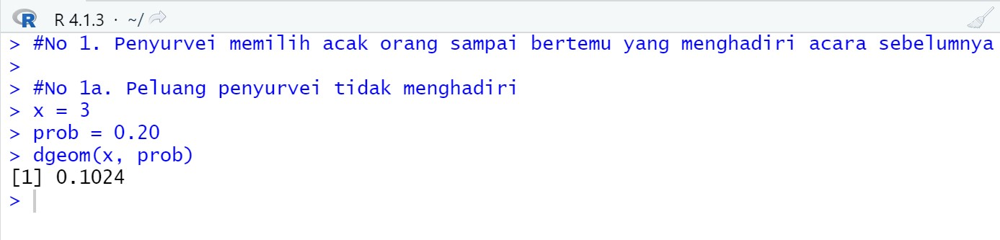
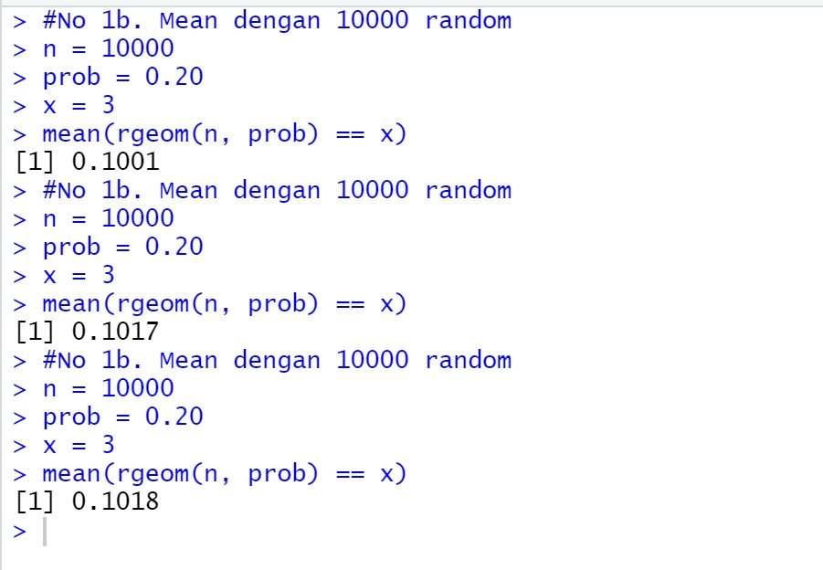

# P1_Probstat_D_5025201263

Rachel Anggieuli Amalia Pasorong  
NRP : 5025201263

## Soal 1  
   

Menggunakan fungsi dgeom  
x = orang yang tidak menghadiri acara vaksinasi
prob = probabilitas keberhasilan yang pertama  
  
    
Menggunakan fungsi rgeom untuk mendapatkan data yang acak dan menggunakan mean untuk mengetahui rata-ratanya   

Dari hasil, maka diketahui bahwa hasil yang didapatkan di poin a akan selalu tetap yaitu 0,1024.   
Sedangkan, hasil yang didapat poin b akan selalu berbeda karena merupakan nilai acak seperti pada gambar.   

   
   
## Soal 2  
   
   
   
   

## Soal 3

   
   
   

## Soal 4

   
   
   
